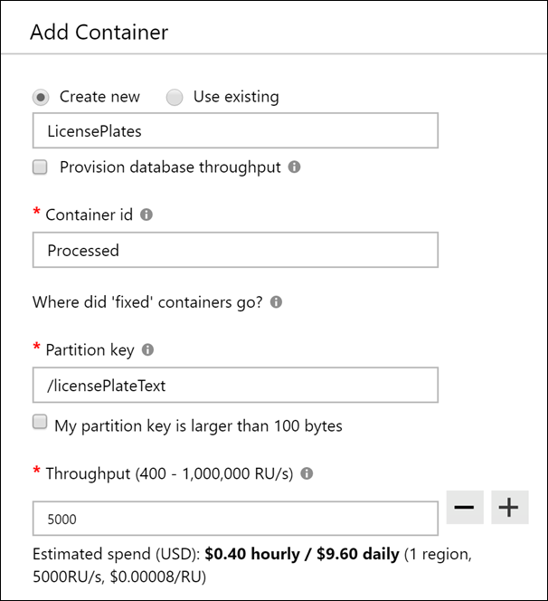
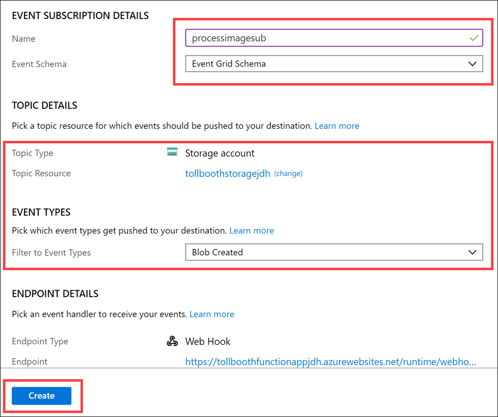
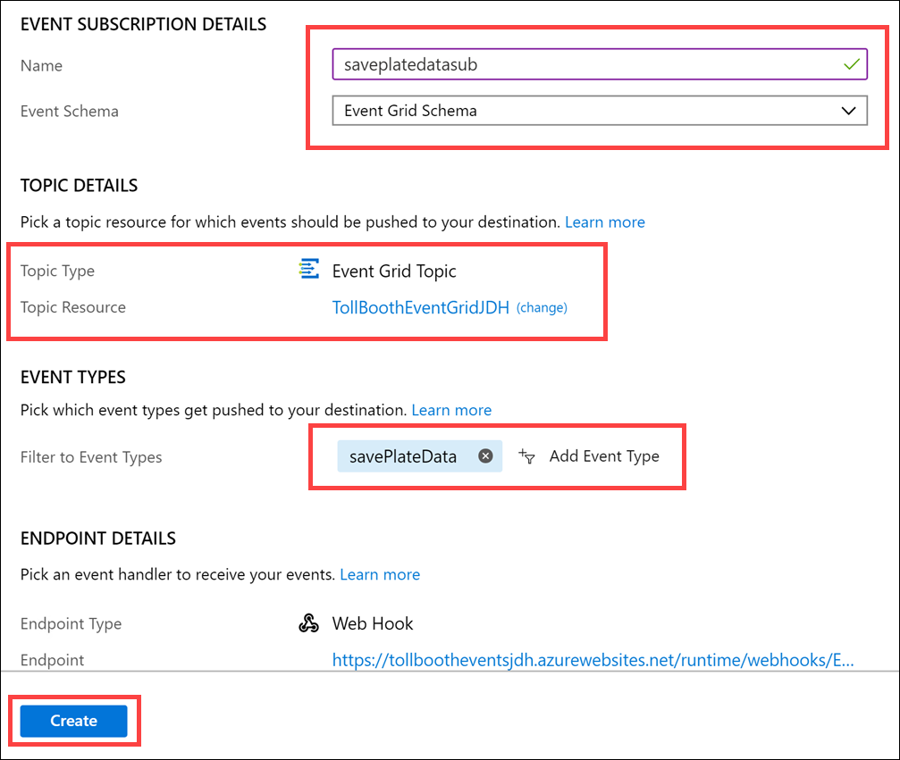
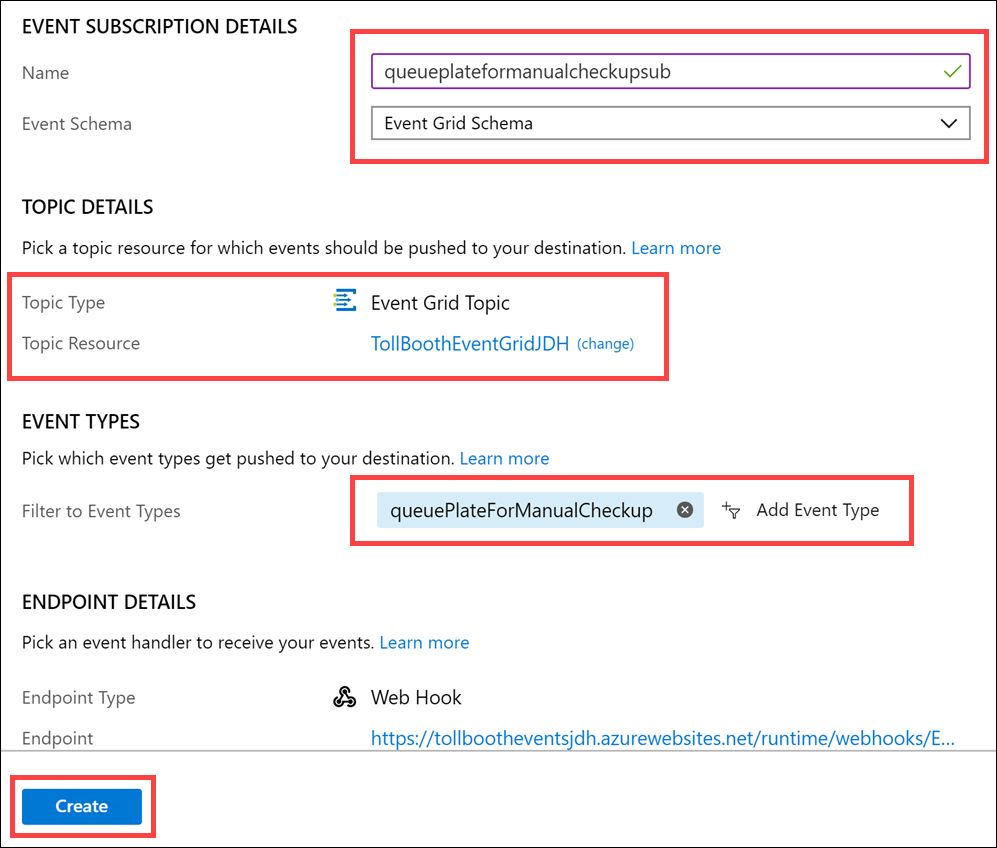
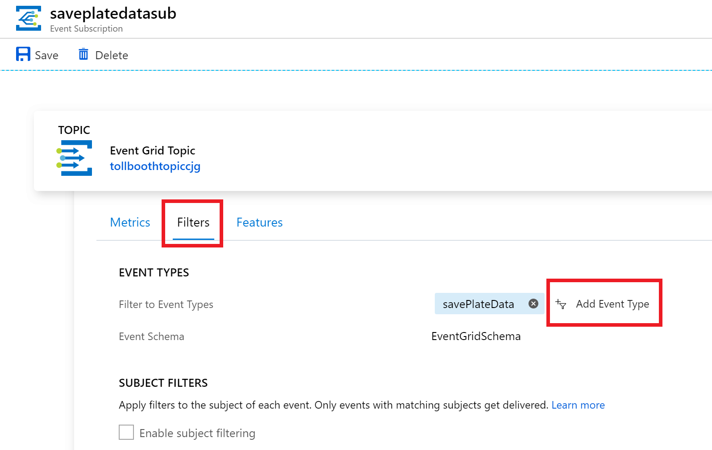
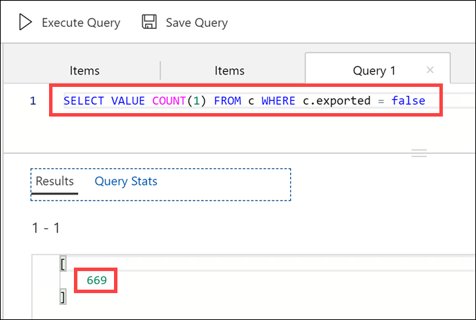

<div class="MCWHeader1">
Serverless architecture
</div>

<div class="MCWHeader2">
Hands-on lab step-by-step
</div>

<div class="MCWHeader3">
March 2019
</div>

Information in this document, including URL and other Internet Web site references, is subject to change without notice. Unless otherwise noted, the example companies, organizations, products, domain names, e-mail addresses, logos, people, places, and events depicted herein are fictitious, and no association with any real company, organization, product, domain name, e-mail address, logo, person, place or event is intended or should be inferred. Complying with all applicable copyright laws is the responsibility of the user. Without limiting the rights under copyright, no part of this document may be reproduced, stored in or introduced into a retrieval system, or transmitted in any form or by any means (electronic, mechanical, photocopying, recording, or otherwise), or for any purpose, without the express written permission of Microsoft Corporation.

Microsoft may have patents, patent applications, trademarks, copyrights, or other intellectual property rights covering subject matter in this document. Except as expressly provided in any written license agreement from Microsoft, the furnishing of this document does not give you any license to these patents, trademarks, copyrights, or other intellectual property.

The names of manufacturers, products, or URLs are provided for informational purposes only and Microsoft makes no representations and warranties, either expressed, implied, or statutory, regarding these manufacturers or the use of the products with any Microsoft technologies. The inclusion of a manufacturer or product does not imply endorsement of Microsoft of the manufacturer or product. Links may be provided to third party sites. Such sites are not under the control of Microsoft and Microsoft is not responsible for the contents of any linked site or any link contained in a linked site, or any changes or updates to such sites. Microsoft is not responsible for webcasting or any other form of transmission received from any linked site. Microsoft is providing these links to you only as a convenience, and the inclusion of any link does not imply endorsement of Microsoft of the site or the products contained therein.

© 2019 Microsoft Corporation. All rights reserved.

Microsoft and the trademarks listed at <https://www.microsoft.com/legal/intellectualproperty/Trademarks/Usage/General.aspx> are trademarks of the Microsoft group of companies. All other trademarks are property of their respective owners.

**Contents**

<!-- TOC -->

- [Serverles architecture hands-on lab step-by-step](#serverles-architecture-hands-on-lab-step-by-step)
  - [Abstract and learning objectives](#abstract-and-learning-objectives)
  - [Overview](#overview)
  - [Solution architecture](#solution-architecture)
  - [Requirements](#requirements)
  - [Exercise 1: Azure data, storage, and serverless environment setup](#exercise-1-azure-data-storage-and-serverless-environment-setup)
    - [Help references](#help-references)
    - [Task 1: Provision the resources](#task-1-provision-the-resources)
    - [Task 2: Configure the Azure Cosmos DB Account](#task-2-provision-the-azure-cosmos-db-account)
  - [Exercise 2: Develop and publish the photo processing and data export functions](#exercise-2-develop-and-publish-the-photo-processing-and-data-export-functions)
    - [Help references](#help-references-1)
    - [Task 1: Finish the ProcessImage function](#task-1-finish-the-processimage-function)
    - [Task 2: Publish the Function App from Visual Studio](#task-2-publish-the-function-app-from-visual-studio)
  - [Exercise 3: Create functions in the portal](#exercise-3-create-functions-in-the-portal)
    - [Help references](#help-references-2)
    - [Task 1: Create function to save license plate data to Azure Cosmos DB](#task-1-create-function-to-save-license-plate-data-to-azure-cosmos-db)
    - [Task 2: Add an Event Grid subscription to the SavePlateData function](#task-2-add-an-event-grid-subscription-to-the-saveplatedata-function)
    - [Task 3: Add an Azure Cosmos DB output to the SavePlateData function](#task-3-add-an-azure-cosmos-db-output-to-the-saveplatedata-function)
    - [Task 4: Create function to save manual verification info to Azure Cosmos DB](#task-4-create-function-to-save-manual-verification-info-to-azure-cosmos-db)
    - [Task 5: Add an Event Grid subscription to the QueuePlateForManualCheckup function](#task-5-add-an-event-grid-subscription-to-the-queueplateformanualcheckup-function)
    - [Task 6: Add an Azure Cosmos DB output to the QueuePlateForManualCheckup function](#task-6-add-an-azure-cosmos-db-output-to-the-queueplateformanualcheckup-function)
    - [Task 7: Configure custom event types for the new Event Grid subscriptions](#task-7-configure-custom-event-types-for-the-new-event-grid-subscriptions)
  - [Exercise 4: Monitor your functions with Application Insights](#exercise-4-monitor-your-functions-with-application-insights)
    - [Help references](#help-references-3)
  - [Exercise 5: Explore your data in Azure Cosmos DB](#exercise-5-explore-your-data-in-azure-cosmos-db)
    - [Help references](#help-references-4)
    - [Task 1: Use the Azure Cosmos DB Data Explorer](#task-1-use-the-azure-cosmos-db-data-explorer)
  - [Exercise 6: Create the data export workflow](#exercise-6-create-the-data-export-workflow)
    - [Help references](#help-references-5)
    - [Task 1: Create the Logic App](#task-1-create-the-logic-app)
  - [Exercise 7: Configure continuous deployment for your Function App](#exercise-7-configure-continuous-deployment-for-your-function-app)
    - [Help references](#help-references-6)
    - [Task 1: Finish your ExportLicensePlates function code and redeploy](#task-1-finish-your-exportlicenseplates-function-code-and-redeploy)
  - [Exercise 8: Rerun the workflow and verify data export](#exercise-8-rerun-the-workflow-and-verify-data-export)
    - [Task 1: Run the Logic App](#task-1-run-the-logic-app)
    - [Task 2: View the exported CSV file](#task-2-view-the-exported-csv-file)
  - [After the hands-on lab](#after-the-hands-on-lab)
    - [Task 1: Delete the resource group in which you placed your Azure resources](#task-1-delete-the-resource-group-in-which-you-placed-your-azure-resources)

<!-- /TOC -->

# Serverles architecture hands-on lab step-by-step 

## Abstract and learning objectives

In this hand-on lab, you will be challenged to implement an end-to-end scenario using a supplied sample that is based on Microsoft Azure Functions, Azure Cosmos DB, Event Grid, and related services. The scenario will include implementing compute, storage, workflows, and monitoring, using various components of Microsoft Azure. The hands-on lab can be implemented on your own, but it is highly recommended to pair up with other members at the lab to model a real-world experience and to allow each member to share their expertise for the overall solution.

At the end of the hands-on-lab, you will have confidence in designing, developing, and monitoring a serverless solution that is resilient, scalable, and cost-effective.

## Overview

Contoso Ltd. is rapidly expanding their toll booth management business to operate in a much larger area. As this is not their primary business, which is online payment services, they are struggling with scaling up to meet the upcoming demand to extract license plate information from a large number of new tollbooths, using photos of vehicles uploaded to cloud storage. Currently, they have a manual process where they send batches of photos to a 3rd-party who manually transcodes the license plates to CSV files that they send back to Contoso to upload to their online processing system. They want to automate this process in a way that is cost effective and scalable. They believe serverless is the best route for them, but do not have the expertise to build the solution.

## Solution architecture

Below is a diagram of the solution architecture you will build in this lab. Please study this carefully, so you understand the whole of the solution as you are working on the various components.


The solution begins with vehicle photos being uploaded to an Azure Storage blobs container, as they are captured. A blob storage trigger fires on each image upload, executing the photo processing **Azure Function** endpoint (on the side of the diagram), which in turn sends the photo to the **Cognitive Services Computer Vision API OCR** service to extract the license plate data. If processing was successful and the license plate number was returned, the function submits a new Event Grid event, along with the data, to an Event Grid topic with an event type called "savePlateData". However, if the processing was unsuccessful, the function submits an Event Grid event to the topic with an event type called "queuePlateForManualCheckup". Two separate functions are configured to trigger when new events are added to the Event Grid topic, each filtering on a specific event type, both saving the relevant data to the appropriate **Azure Cosmos DB** collection for the outcome, using the Cosmos DB output binding. A **Logic App** that runs on a 15-minute interval executes an Azure Function via its HTTP trigger, which is responsible for obtaining new license plate data from Cosmos DB and exporting it to a new CSV file saved to Blob storage. If no new license plate records are found to export, the Logic App sends an email notification to the Customer Service department via their Office 365 subscription. **Application Insights** is used to monitor all of the Azure Functions in real-time as data is being processed through the serverless architecture. This real-time monitoring allows you to observe dynamic scaling first-hand and configure alerts when certain events take place.

## Requirements

-  Microsoft Azure subscription (non-Microsoft subscription)
-  Local machine or a virtual machine configured with (**complete the day before the lab!**):
    - Visual Studio Community 2017 or greater, **version 15.4** or later
        -  <https://www.visualstudio.com/vs/>
    - Azure development workload for Visual Studio 2017/2019
        -  <https://docs.microsoft.com/azure/azure-functions/functions-develop-vs#prerequisites>
    - .NET Framework 4.7 runtime (or higher)
        -  <https://www.microsoft.com/net/download/windows>
-  Office 365 account. If required, you can sign up for an Office 365 trial at:
    - <https://portal.office.com/Signup/MainSignup15.aspx?Dap=False&QuoteId=79a957e9-ad59-4d82-b787-a46955934171&ali=1>
-  GitHub account. You can create a free account at <https://github.com>.

## Exercise 1: Azure data, storage, and serverless environment setup

**Duration**: 10 minutes

You must provision a few resources in Azure before you start developing the solution. Ensure all resources use the same resource group for easier cleanup.

In this exercise, you will provision a blob storage account using the Hot tier, and create two containers within to store uploaded photos and exported CSV files. You will then provision two Function Apps instances, one you will deploy from Visual Studio, and the other you will manage using the Azure portal. Next, you will create a new Event Grid topic. After that, you will create an Azure Cosmos DB account with two collections. Finally, you will provision a new Cognitive Services Computer Vision API service for applying object character recognition (OCR) on the license plates.

### Help references

|                                            |                                                                                                                                                       |
| ------------------------------------------ | :---------------------------------------------------------------------------------------------------------------------------------------------------: |
| **Description**                            |                                                                       **Links**                                                                       |
| Creating a storage account (blob hot tier) | <https://docs.microsoft.com/azure/storage/common/storage-create-storage-account?toc=%2fazure%2fstorage%2fblobs%2ftoc.json%23create-a-storage-account> |
| Creating a function app                    |                                <https://docs.microsoft.com/azure/azure-functions/functions-create-function-app-portal>                                |
| Concepts in Event Grid                     |                                                <https://docs.microsoft.com/azure/event-grid/concepts>                                                 |
| Creating an Azure Cosmos DB account        |                                              <https://docs.microsoft.com/azure/cosmos-db/manage-account>                                              |

### Task 1: Provision the resources

1.  Using a new tab or instance of your browser, navigate to the Azure Management portal, <http://portal.azure.com>.

2.  In the search bar at the top, enter **custom template**, then select **Deploy a custom template**.

3.  Select **Build your own template in the editor**.

4.  Use **Load file** to upload [starter\arm.json](starter/arm.json) (or just cut and paste it in).

5.  Click **Save**.

6.  Select **Create new** for the resource group and give it a suitable name (e.g. **belfastbootcamp**). For the **Suffix** setting, provide a short unique alphanumeric code to avoid clashing with other workshoppers.

7.  Agree to the terms and click **Purchase**.

8.  Once the deployment completes (probably a bit over 5 minutes) your resource group will contain all the required resources, and the function app settings will be in place.

### Task 2: Configure the Azure Cosmos DB account

1.  In the Azure Portal, select the Cosmos DB account in the new resource group.

2.  Select **Browse** in the blade menu, then select **+ Add Collection**.

    

3.  On the **Add Collection** blade, specify the following configuration options:

    a. Enter **LicensePlates** for the **Database id**.

    b. Leave **Provision database throughput** unchecked.

    c. Enter **Processed** for the **Collection id**.

    d. Partition key: **/licensePlateText**

    e. Throughput: **5000**

    

4.  Select **OK**.

5.  Select **New Collection** to add another collection.

6. On the **Add Collection** blade, specify the following configuration options:

    a. For Database id, choose **Use existing** and select **LicensePlates**.

    b. For Collection id, enter **NeedsManualReview**.

    c. Partition key: **/fileName**

    d. Throughput: **5000**

    

7. Select **OK**.

### Task 3: Create blob storage containers

1.  Navigate to the blob storage account in the Azure Portal. 

2.  Select **Blobs** under **Blob Service** in the menu. Then select the **+ Container** button to add a new container. In the **Name** field, enter **images**, select **Private (no anonymous access)** for the public access level, then select **OK** to save.

    

3.  Repeat these steps to create a container named **export**.

    

## Exercise 2: Develop and publish the photo processing and data export functions

**Duration**: 30 minutes

Use Visual Studio 2017/2019 and its integrated Azure Functions tooling to develop and debug the functions locally, and then publish them to Azure. The starter project solution, TollBooths, contains most of the code needed. You will add in the missing code before deploying to Azure.

### Help references

|                                       |                                                                        |
| ------------------------------------- | :--------------------------------------------------------------------: |
| **Description**                       |                               **Links**                                |
| Code and test Azure Functions locally | <https://docs.microsoft.com/azure/azure-functions/functions-run-local> |

### Task 1: Finish the ProcessImage function

There are a few components within the starter project that must be completed, marked as TODO in the code. The first set of TODO items we will address are in the ProcessImage function, the FindLicensePlateText class that calls the Computer Vision API, and finally the SendToEventGrid.cs class, which is responsible for sending processing results to the Event Grid topic you created earlier.

> **Note:** Do **NOT** update the version of any NuGet package. This solution is built to function with the NuGet package versions currently defined within. Updating these packages to newer versions could cause unexpected results.

1.  Navigate to the **TollBooth** project using the Solution Explorer of Visual Studio.

2.  From the Visual Studio **View** menu, select **Task List**.

    

3.  There you will see a list of TODO tasks, where each task represents one line of code that needs to be completed.

> 

1.  Open **ProcessImage.cs**. Notice that the Run method is decorated with the FunctionName attribute, which sets the name of the Azure Function to "ProcessImage". This is triggered by HTTP requests sent to it from the Event Grid service. You tell Event Grid that you want to get these notifications at your function's URL by creating an event subscription, which you will do in a later task, in which you subscribe to blob-created events. The function's trigger watches for new blobs being added to the images container of the storage account that was created in Exercise 1. The data passed to the function from the Event Grid notification includes the URL of the blob. That URL is in turn passed to the input binding to obtain the uploaded image from Blob storage.

2.  The following code represents the completed task in ProcessImage.cs:

```csharp
// **TODO 1: Set the licensePlateText value by awaiting a new FindLicensePlateText.GetLicensePlate method.**

licensePlateText = await new FindLicensePlateText(log, _client).GetLicensePlate(licensePlateImage);
```

6.  Open **FindLicensePlateText.cs**. This class is responsible for contacting the Computer Vision API to find and extract the license plate text from the photo, using OCR. Notice that this class also shows how you can implement a resilience pattern using [Polly](https://github.com/App-vNext/Polly), an open source .NET library that helps you handle transient errors. This is useful for ensuring that you do not overload downstream services, in this case, the Computer Vision API. This will be demonstrated later on when visualizing the Function's scalability.

7.  The following code represents the completed task in FindLicensePlateText.cs:

```csharp
// TODO 2: Populate the below two variables with the correct AppSettings properties.
var uriBase = Environment.GetEnvironmentVariable("computerVisionApiUrl");
var apiKey = Environment.GetEnvironmentVariable("computerVisionApiKey");
```

8.  Open **SendToEventGrid.cs**. This class is responsible for sending an Event to the Event Grid topic, including the event type and license plate data. Event listeners will use the event type to filter and act on the events they need to process. Make note of the event types defined here (the first parameter passed into the Send method), as they will be used later on when creating new functions in the second Function App you provisioned earlier.

9.  The following code represents the completed tasks in SendToEventGrid.cs:

```csharp
// TODO 3: Modify send method to include the proper eventType name value for saving plate data.
await Send("savePlateData", "TollBooth/CustomerService", data);

// TODO 4: Modify send method to include the proper eventType name value for queuing plate for manual review.
await Send("queuePlateForManualCheckup", "TollBooth/CustomerService", data);
```

### Task 2: Publish the Function App from Visual Studio

In this task, you will publish the Function App from the starter project in Visual Studio to the existing Function App you provisioned in Azure.

1.  Navigate to the **TollBooth** project using the Solution Explorer of Visual Studio.

2.  Right-click the **TollBooth** project and select **Publish** from the context menu.

    

3.  In the Pick a Publish Target window that appears, make sure **Azure Function App** is selected, choose the **Select Existing** radio button, then select **Publish**.

    

>**Note**:  If you do not see the ability to publish to an Azure Function, you may need to update your Visual Studio instance.

1.  In the App Service form, select your **Subscription**, select **Resource Group** under **View**, then expand your **ServerlessArchitecture** resource group and select the Function App whose name ends with **FunctionApp**.

2.  Whatever you named the Function App when you provisioned it is fine. Just make sure it is the same one to which you applied the Application Settings in Task 1 of this exercise.

    

3.  After you select the Function App, select **OK**.

    > **Note**:  If prompted to update the functions version on Azure, click **Yes**.

4.  Watch the Output window in Visual Studio as the Function App publishes. When it is finished, you should see a message that says, "Publish Succeeded."

5.  Using a new tab or instance of your browser navigate to the Azure Management portal, <http://portal.azure.com>.

6.  Open the **ServerlessArchitecture** resource group, then select the Azure Function App to which you just published.

7.  Expand the functions underneath your Function App in the menu. You should see both functions you just published from the Visual Studio solution listed.

    

8.  Now we need to add an Event Grid subscription to the ProcessImage function so the function is triggered when new images are added to blob storage. Select the **ProcessImage** function, then select **Add Event Grid subscription**.

    

9.  On the **Create Event Subscription** blade, specify the following configuration options:

    a. **Name**: Unique value for the App name similar to **processimagesub** (ensure the green check mark appears).
    
    b. **Event Schema**: Select Event Grid Schema.
    
    c. For **Topic Type**, select **Storage Accounts**.

    d. Select your **subscription** and **ServerlessArchitecture** resource group.

    e. For resource, select your recently created Event Grid.

    f. _Uncheck_ **Subscribe to all event types**, then select **Blob Created** from the event types dropdown list.

    g. Leave Web Hook as the Endpoint Type.

10. Leave the remaining fields at their default values and select **Create**.

    

## Exercise 3: Create functions in the portal

**Duration**: 45 minutes

Create two new Azure Functions written in Node.js, using the Azure portal. These will be triggered by Event Grid and output to Azure Cosmos DB to save the results of license plate processing done by the ProcessImage function.

### Help references

|                                                                   |                                                                                                         |
| ----------------------------------------------------------------- | :-----------------------------------------------------------------------------------------------------: |
| **Description**                                                   |                                                **Links**                                                |
| Create your first function in the Azure portal                    |        <https://docs.microsoft.com/azure/azure-functions/functions-create-first-azure-function>         |
| Store unstructured data using Azure Functions and Azure Cosmos DB | <https://docs.microsoft.com/azure/azure-functions/functions-integrate-store-unstructured-data-cosmosdb> |

### Task 1: Create function to save license plate data to Azure Cosmos DB

In this task, you will create a new Node.js function triggered by Event Grid and that outputs successfully processed license plate data to Azure Cosmos DB.

1.  Using a new tab or instance of your browser navigate to the Azure Management portal, <http://portal.azure.com>.

2.  Open the **ServerlessArchitecture** resource group, then select the Azure Function App you created whose name ends with **Events**. If you did not use this naming convention, make sure you select the Function App that you _did not_ deploy to in the previous exercise.

3.  Select **Functions** in the menu. In the **Functions** blade, select **+ New Function**.

    

4.  Enter **event grid** into the template search form, then select the **Azure Event Grid trigger** template.  

    a.  If prompted, click **Install** and wait for the extension to install.

    b.  Click **Continue**

    

5.  In the New Function form, fill out the following properties:

    a. For name, enter **SavePlateData**

    

    b.  Select **Create**.

6)  Replace the code in the new SavePlateData function with the following:

```javascript
module.exports = function (context, eventGridEvent) {
    context.log(typeof eventGridEvent);
    context.log(eventGridEvent);

    context.bindings.outputDocument = {
        fileName : eventGridEvent.data["fileName"],
        licensePlateText : eventGridEvent.data["licensePlateText"],
        timeStamp : eventGridEvent.data["timeStamp"],
        exported : false
    }

    context.done();
};
```

8.  Select **Save**.

### Task 2: Add an Event Grid subscription to the SavePlateData function

In this task, you will add an Event Grid subscription to the SavePlateData function. This will ensure that the events sent to the Event Grid topic containing the savePlateData event type are routed to this function.

1.  With the SavePlateData function open, select **Add Event Grid subscription**.

    

2.  On the **Create Event Subscription** blade, specify the following configuration options:

    a. **Name**: Unique value for the App name similar to **saveplatedatasub** (ensure the green check mark appears).
    
    b. **Event Schema**: Select Event Grid Schema.
    
    c. For **Topic Type**, select **Event Grid Topics**.

    d. Select your **subscription** and **ServerlessArchitecture** resource group.

    e. For resource, select your recently created Event Grid.

    f. Ensure that **Subscribe to all event types** is checked. You will enter a custom event type later.

    g. Leave Web Hook as the Endpoint Type.

3.  Leave the remaining fields at their default values and select **Create**.

    

### Task 3: Add an Azure Cosmos DB output to the SavePlateData function

In this task, you will add an Azure Cosmos DB output binding to the SavePlateData function, enabling it to save its data to the Processed collection.

1.  Expand the **SavePlateData** function in the menu, then select **Integrate**.

2.  Under Outputs, select **+ New Output**, select **Azure Cosmos DB** from the list of outputs, then select **Select**.

    

3.  In the Azure Cosmos DB output form, select **new** next to the Azure Cosmos DB account connection field.

    

    > **Note**: If you see a notice for "Extensions not installed", click **Install**.

4.  Select your Cosmos DB account from the list that appears.

5.  Specify the following configuration options in the Azure Cosmos DB output form:

    a. For database name, type **LicensePlates**.

    b. For the collection name, type **Processed**.

    

6.  Select **Save**.

    > **Note**: you should wait for the template dependency to install if you were prompted earlier.

### Task 4: Create function to save manual verification info to Azure Cosmos DB

In this task, you will create a new function triggered by Event Grid and outputs information about photos that need to be manually verified to Azure Cosmos DB.

1.  Select **Functions** in the menu. In the **Functions** blade, select **+ New Function**.

    

2.  Enter **event grid** into the template search form, then select the **Azure Event Grid trigger** template.

    a.  If prompted, click **Install** and wait for the extension to install.

    b.  Click **Continue**.

    

3.  In the **New Function** form, fill out the following properties:

    a. For name, type **QueuePlateForManualCheckup**.

    

4.  Select **Create**.

5.  Replace the code in the new QueuePlateForManualCheckup function with the following:

```javascript
module.exports = async function (context, eventGridEvent) {
    context.log(typeof eventGridEvent);
    context.log(eventGridEvent);

    context.bindings.outputDocument = {
        fileName : eventGridEvent.data["fileName"],
        licensePlateText : "",
        timeStamp : eventGridEvent.data["timeStamp"],
        resolved : false
    }

    context.done();
};
```

6.  Select **Save**.

### Task 5: Add an Event Grid subscription to the QueuePlateForManualCheckup function

In this task, you will add an Event Grid subscription to the QueuePlateForManualCheckup function. This will ensure that the events sent to the Event Grid topic containing the queuePlateForManualCheckup event type are routed to this function.

1.  With the QueuePlateForManualCheckup function open, select **Add Event Grid subscription**.

    

2.  On the **Create Event Subscription** blade, specify the following configuration options:

    a. **Name**: Unique value for the App name similar to **queueplateFormanualcheckupsub** (ensure the green check mark appears).
    
    b. **Event Schema**: Select Event Grid Schema.
    
    c. For **Topic Type**, select **Event Grid Topics**.

    d. Select your **subscription** and **ServerlessArchitecture** resource group.

    e. For resource, select your recently created Event Grid.

    f. Ensure that **Subscribe to all event types** is checked. You will enter a custom event type later.

    g. Leave Web Hook as the Endpoint Type.

3.  Leave the remaining fields at their default values and select **Create**.

    

### Task 6: Add an Azure Cosmos DB output to the QueuePlateForManualCheckup function

In this task, you will add an Azure Cosmos DB output binding to the QueuePlateForManualCheckup function, enabling it to save its data to the NeedsManualReview collection.

1.  Expand the QueuePlateForManualCheckup function in the menu, the select **Integrate**.

2.  Under Outputs, select **+ New Output** then select **Azure Cosmos DB** from the list of outputs, then select **Select**.

    

3.  Specify the following configuration options in the Azure Cosmos DB output form:

    > **Note**: If you see a notice for "Extensions not installed", click **Install**.

    a. For database name, enter **LicensePlates**.

    b. For collection name, enter **NeedsManualReview**.

    c. Select the **Azure Cosmos DB account connection** you created earlier.

    

4.  Select **Save**.

### Task 7: Configure custom event types for the new Event Grid subscriptions

In this task, you will configure a custom event type for each new Event Grid subscription you created for your functions in the previous steps of this exercise. Currently the event types are set to All. We want to narrow this down to only the event types specified within the SendToEventGrid class in the TollBooth solution. This will ensure that all other event types are ignored by your functions.

1.  Using a new tab or instance of your browser navigate to the Azure Management portal, <http://portal.azure.com>.

2.  Open the **ServerlessArchitecture** resource group, then select your Event Grid Topic.

3.  At the bottom of the **Overview** blade, you will see both Event Grid subscriptions created from the functions. Select **saveplatedatasub**.

    

4.  Select the **Filters** tab, then _uncheck_ **Subscribe to all event types**.

5.  Select the **Delete** button (x inside of a circle) on the **All** event type to delete it.

    

5.  Select **Add Event Type**, then enter **savePlateData** into the event types field. If you specified a different name in the SendToEventGrid class in the TollBooth solution, use that instead.

    

6.  Select **Save**.

7.  Select the **queueplateformanualcheckupsub** Event Grid subscription at the bottom of the **Overview** blade.

    

8.  Select the **Filters** tab, then _uncheck_ **Subscribe to all event types**.

9.  Select the **Delete** button (x inside of a circle) on the **All** event type to delete it.

    

9.  Select **Add Event Type**, then enter **queuePlateForManualCheckup** into the event types field. If you specified a different name in the SendToEventGrid class in the TollBooth solution, use that instead.

    

10. Select **Save**.

## Exercise 4: Monitor your functions with Application Insights

**Duration**: 0 minutes

Exercise removed for speed :)

## Exercise 5: Explore your data in Azure Cosmos DB

**Duration**: 15 minutes

In this exercise, you will use the Azure Cosmos DB Data Explorer in the portal to view saved license plate data. It is entirely optional and can be safely skipped or left to the end.

### Help references

|                       |                                                           |
| --------------------- | :-------------------------------------------------------: |
| **Description**       |                         **Links**                         |
| About Azure Cosmos DB | <https://docs.microsoft.com/azure/cosmos-db/introduction> |

### Task 1: Use the Azure Cosmos DB Data Explorer

1.  Open your Azure Cosmos DB account by opening the **ServerlessArchitecture** resource group, and then selecting the **Azure Cosmos DB account** name.

2.  Select **Data Explorer** from the menu.

    

3.  Expand the **Processed** collection, then select **Documents**. This will list each of the JSON documents added to the collection.

4.  Select one of the documents to view its contents. The first four properties are ones that were added by your functions. The remaining properties are standard and are assigned by Cosmos DB.

    

5.  Expand the **NeedsManualReview** collection, then select **Documents**.

6.  Select one of the documents to view its contents. Notice that the filename is provided, as well as a property named "resolved". While this is out of scope for this lab, those properties can be used together to provide a manual process for viewing the photo and entering the license plate.

    

7.  Right-click on the **Processed** collection and select **New SQL Query**.

    

8.  Modify the SQL query to count the number of processed documents that have not been exported:

```sql
SELECT VALUE COUNT(c.id) FROM c WHERE c.exported = false
```

9.  Execute the query and observe the results. In our case, we have 1,369 processed documents that need to be exported.

    

## Exercise 6: Create the data export workflow

**Duration**: 30 minutes

In this exercise, you create a new Logic App for your data export workflow. This Logic App will execute periodically and call your ExportLicensePlates function, then conditionally send an email if there were no records to export.

### Help references

|                                      |                                                                                                                 |
| ------------------------------------ | :-------------------------------------------------------------------------------------------------------------: |
| **Description**                      |                                                    **Links**                                                    |
| What are Logic Apps?                 |                  <https://docs.microsoft.com/azure/logic-apps/logic-apps-what-are-logic-apps>                   |
| Call Azure Functions from logic apps | <https://docs.microsoft.com/azure/logic-apps/logic-apps-azure-functions%23call-azure-functions-from-logic-apps> |

### Task 1: Create the Logic App

1.  Navigate to the Azure Management portal, <http://portal.azure.com>.

2.  Select **+ Create a resource**, then enter **logic app** into the search box on top. Select **Logic App** from the results.

    

3.  Select the **Create** button on the Logic App overview blade.

4.  On the **Create Logic App** blade, specify the following configuration options:

    a. For Name, type a unique value for the App name similar to **TollBoothLogic** (ensure the green check mark appears).

    b. Specify the Resource Group **ServerlessArchitecture**.

    c. Select the same **location** as your Resource Group.

    d. Select **Off** underneath Log Analytics.

    

5.  Click **Create**.  Open the Logic App once it has been provisioned.

6.  In the Logic App Designer, scroll through the page until you locate the _Start with a common trigger_ section. Select the **Recurrence** trigger.

    

7.  Enter **15** into the **Interval** box, and make sure Frequency is set to **Minute**. This can be set to an hour or some other interval, depending on business requirements.

8.  Select **+ New step**.

    

9. Enter **Functions** in the filter box, then select the **Azure Functions** connector.

    

10. Select your Function App whose name ends in **FunctionApp**, or contains the ExportLicensePlates function.

    

11. Select the **ExportLicensePlates** function from the list.

    

12. This function does not require any parameters that need to be sent when it gets called. Select **+ New step**, then search for **condition**. Select the **Condition** Control option from the Actions search result.

    

13. For the **value** field, select the **Status code** parameter. Make sure the operator is set to **is equal to**, then enter **200** in the second value field. 

    >**Note**: This evaluates the status code returned from the ExportLicensePlates function, which will return a 200 code when license plates are found and exported. Otherwise, it sends a 204 (NoContent) status code when no license plates were discovered that need to be exported. We will conditionally send an email if any response other than 200 is returned.

    

14. We will ignore the If true condition because we don't want to perform an action if the license plates are successfully exported. Select **Add an action** within the **If false** condition block.

    

15. Enter **Send an email** in the filter box, then select the **Send an email** action.

    

16. Click **Sign in** and sign into your Office 365 Outlook account.

    

17. In the Send an email form, provide the following values:

    a. Enter your email address in the **To** box.

    b. Provide a **subject**, such as **Toll Booth license plate export failed**.

    c. Enter a message into the **body**, and select the **Status code** from the ExportLicensePlates function so that it is added to the email body.

    

18. Select **Save** in the tool bar to save your Logic App.

19. Select **Run** to execute the Logic App. You should start receiving email alerts because the license plate data is not being exported. This is because we need to finish making changes to the ExportLicensePlates function so that it can extract the license plate data from Azure Cosmos DB, generate the CSV file, and upload it to Blob storage.

    

20. While in the Logic Apps Designer, you will see the run result of each step of your workflow. A green checkmark is placed next to each step that successfully executed, showing the execution time to complete. This can be used to see how each step is working, and you can select the executed step and see the raw output.

    

21. The Logic App will continue to run in the background, executing every 15 minutes (or whichever interval you set) until you disable it. To disable the app, go to the **Overview** blade for the Logic App and select the **Disable** button on the taskbar.

    

## Exercise 7: Configure continuous deployment for your Function App

**Duration**: 10 minutes

Azure DevOps removed for speed. We'll just use right-click deploy again :)

### Task 1: Finish your ExportLicensePlates function code and redeploy

1.  Navigate to the **TollBooth** project using the Solution Explorer of Visual Studio.

2.  From the Visual Studio **View** menu, select **Task List**.

    

3.  There you will see a list of TODO tasks, where each task represents one line of code that needs to be completed.

4.  Open **DatabaseMethods.cs**.

5.  The following code represents the completed task in DatabaseMethods.cs:

```csharp
// TODO 5: Retrieve a List of LicensePlateDataDocument objects from the collectionLink where the exported value is false.
licensePlates = _client.CreateDocumentQuery<LicensePlateDataDocument>(collectionLink,
        new FeedOptions() { EnableCrossPartitionQuery=true,MaxItemCount = 100 })
    .Where(l => l.exported == false)
    .ToList();
// TODO 6: Remove the line below.
```

6.  Make sure that you deleted the following line under TODO 6: licensePlates = new List\<LicensePlateDataDocument\>();.

7.  Save your changes then open **FileMethods.cs**.

8.  The following code represents the completed task in DatabaseMethods.cs:

```csharp
// TODO 7: Asyncronously upload the blob from the memory stream.
await blob.UploadFromStreamAsync(stream);
```

9.  Save your changes.

10. Re-publish the app as you did before in Exercise 2.

## Exercise 8: Rerun the workflow and verify data export

**Duration**: 10 minutes

With the latest code changes in place, run your Logic App and verify that the files are successfully exported.

### Task 1: Run the Logic App

1.  Open your ServerlessArchitecture resource group in the Azure portal, then select your Logic App.

2.  From the **Overview** blade, select **Enable**.

    

3.  Now select **Run Trigger**, then select **Recurrence** to immediately execute your workflow.

    

4.  Select the **Refresh** button next to the Run Trigger button to refresh your run history. Select the latest run history item. If the expression result for the condition is **true**, then that means the CSV file should've been exported to Blob storage. Be sure to disable the Logic App so it doesn't keep sending you emails every 15 minutes. Please note that it may take longer than expected to start running, in some cases.

    

### Task 2: View the exported CSV file

1.  Open your ServerlessArchitecture resource group in the Azure portal, then select your **Storage account** you had provisioned to store uploaded photos and exported CSV files.

2.  In the Overview pane of your storage account, select **Blobs**.

    

3.  Select the **export** container.

    

4.  You should see at least one recently uploaded CSV file. Select the filename to view its properties.

    

5.  Select **Download** in the blob properties window.

    

    The CSV file should look similar to the following:

    

6.  The ExportLicensePlates function updates all of the records it exported by setting the exported value to true. This makes sure that only new records since the last export are included in the next one. Verify this by re-executing the script in Azure Cosmos DB that counts the number of documents in the Processed collection where exported is false. It should return 0 unless you've subsequently uploaded new photos.

## After the hands-on lab

**Duration**: 5 minutes

In this exercise, attendees will deprovision any Azure resources that were created in support of the lab.

### Task 1: Delete the resource group in which you placed your Azure resources

1.  From the Portal, navigate to the blade of your **Resource Group** and select **Delete** in the command bar at the top.

2.  Confirm the deletion by re-typing the **resource group name** and selecting **Delete**.

You should follow all steps provided *after* attending the Hands-on lab.
